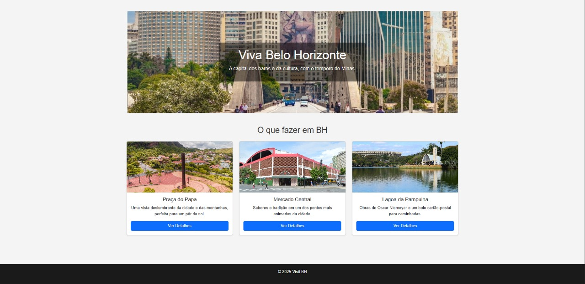
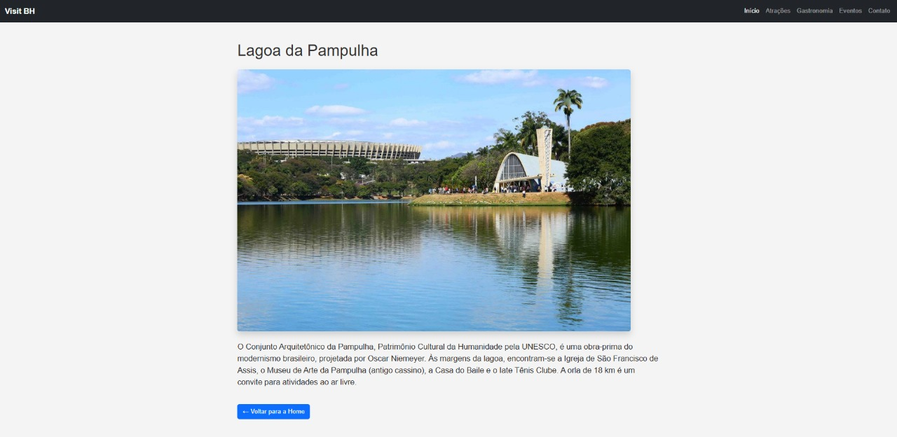

[](https://classroom.github.com/online_ide?assignment_repo_id=20702311&assignment_repo_type=AssignmentRepo)
# Trabalho Prático 05 - Semanas 7 e 8

**Páginas de detalhes dinâmicas**

Nessa etapa, vamos evoluir o trabalho anterior, acrescentando a página de detalhes, conforme o  projeto escolhido. Imagine que a página principal (home-page) mostre um visão dos vários itens que existem no seu site. Ao clicar em um item, você é direcionado pra a página de detalhes. A página de detalhe vai mostrar todas as informações sobre o item do seu projeto. seja esse item uma notícia, filme, receita, lugar turístico ou evento.

Leia o enunciado completo no Canvas. 

**IMPORTANTE:** Assim como informado anteriormente, capriche na etapa pois você vai precisar dessa parte para as próximas semanas. 

**IMPORTANTE:** Você deve trabalhar e alterar apenas arquivos dentro da pasta **`public`,** mantendo os arquivos **`index.html`**, **`styles.css`** e **`app.js`** com estes nomes, conforme enunciado. Deixe todos os demais arquivos e pastas desse repositório inalterados. **PRESTE MUITA ATENÇÃO NISSO.**

## Informações Gerais

- Nome:Izabela Ribeiro Câmara
- Matricula:737464
- Proposta de projeto escolhida: Lugares e Experiências
- Breve descrição sobre seu projeto: O "Visit BH" é um protótipo de um portal de turismo focado nos principais pontos de interesse de Belo Horizonte.

## Print da Home-Page

<<  COLOQUE A IMAGEM AQUI >>


## Print da página de detalhes do item

<<  COLOQUE A IMAGEM AQUI >>


## Cole aqui abaixo a estrutura JSON utilizada no app.js

```javascript
const dadosAtracoes = [
  {
    "id": 1,
    "titulo": "Praça do Papa",
    "descricao": "Uma vista deslumbrante da cidade e das montanhas, perfeita para um pôr do sol.",
    "imagem": "images/papa.jpg",
    "conteudo": "Localizada no alto do bairro Mangabeiras, a Praça Governador Israel Pinheiro, mais conhecida como Praça do Papa, é um dos cartões-postais de Belo Horizonte. O nome popular surgiu após a visita do Papa João Paulo II em 1980, que celebrou uma missa campal no local e proferiu a famosa frase: 'Que belo horizonte!'. Além da vista panorâmica da cidade, a praça é um espaço de lazer para famílias, com áreas verdes e monumentos.",
    "categoria": "Mirante"
  },
  {
    "id": 2,
    "titulo": "Mercado Central",
    "descricao": "Sabores e tradição em um dos pontos mais animados da cidade.",
    "imagem": "images/mercado.jpg",
    "conteudo": "O Mercado Central é o coração pulsante de Belo Horizonte. Fundado em 1929, o espaço reúne mais de 400 lojas que vendem de tudo um pouco: queijos artesanais, doces mineiros, cachaças, ervas medicinais, artesanato e os famosos petiscos de fígado com jiló. É um labirinto de cores, aromas e sabores que representa a cultura e a gastronomia de Minas Gerais.",
    "categoria": "Gastronomia"
  },
  {
    "id": 3,
    "titulo": "Lagoa da Pampulha",
    "descricao": "Obras de Oscar Niemeyer e um belo cartão-postal para caminhadas.",
    "imagem": "images/Lp.jpg",
    "conteudo": "O Conjunto Arquitetônico da Pampulha, Patrimônio Cultural da Humanidade pela UNESCO, é uma obra-prima do modernismo brasileiro, projetada por Oscar Niemeyer. Às margens da lagoa, encontram-se a Igreja de São Francisco de Assis, o Museu de Arte da Pampulha (antigo cassino), a Casa do Baile e o Iate Tênis Clube. A orla de 18 km é um convite para atividades ao ar livre.",
    "categoria": "Arquitetura"
  }
];